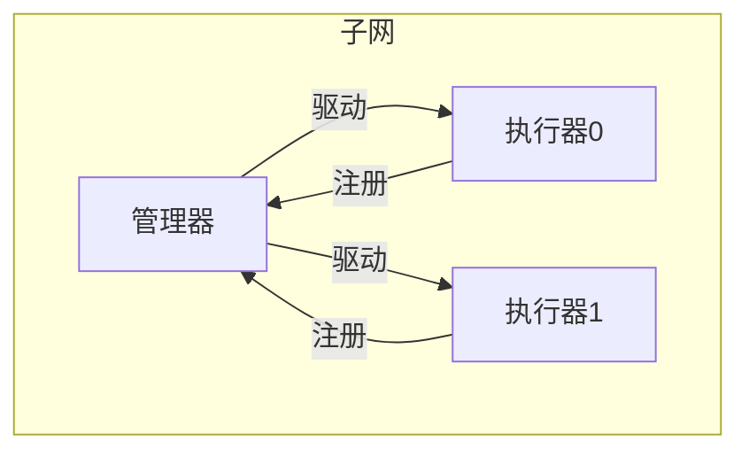
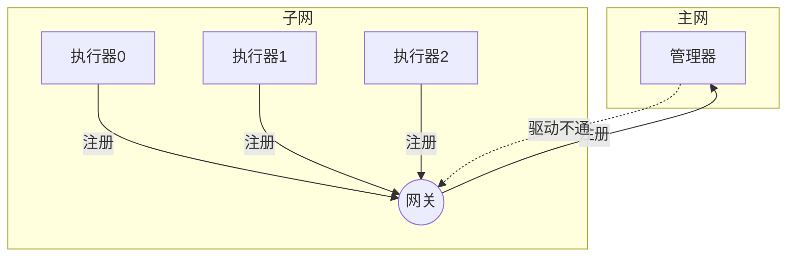
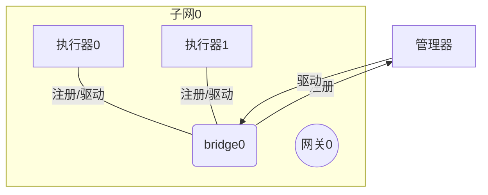
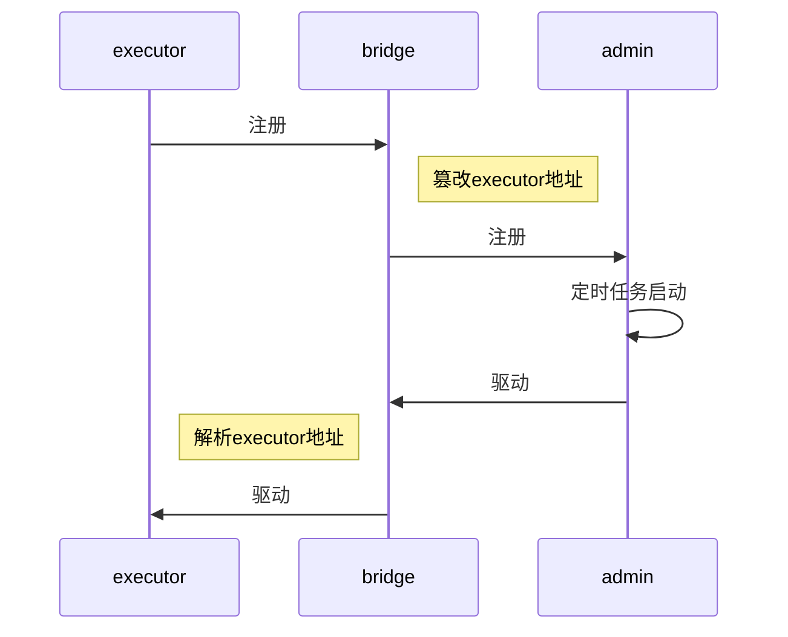

# fu-xxljob-bridge
xxljob子网透传器

### 使用场景
1. 当定时任务执行器和定时任务管理器不在同一子网内时，xxljob-bridge 用于透传
2. 当要自定义任务日志，如日志要写到日志中心并配置任务失败报警

#### 执行器和管理器同一网段时

#### 不同网段时（执行器在K8S集群内）

#### 使用 xxljob-bridge 用于透传


### 原理

1.  xxljob-bridge 服务放在 xxljob-executor 同一子网
2.  同一应用的多个节点启动后 xxljob-executor 向 xxljob-bridge 服务注册(原来是向xxljob-admin注册)
3.  xxljob-bridge把注册的内容中的executor地址改为 xxljob-bridge代理地址  如:原地址为http://10.0.12.3:9999/ 改为 http://bridge.public.yourdomain.com/xxl-job-executor/http:@@10.0.12.3:9999/
4.  xxljob-bridge把篡改后地注册信息提交到xxljob-admin注册
5.  xxljob-admin 发驱动调用 到xxljob-bridge
6.  xxljob-bridge 分解URL，转发到xxljob-executor实例



### SpringBoot方式
#### Maven引用

```xml
<dependency>
	<groupId>fun.utils</groupId>
	<artifactId>xxljob.bridge.starter</artifactId>
	<version>0.0.1-SNAPSHOT</version>
</dependency>
```
#### 启动
不用写代码，引用xxljob.bridge.starter的Maven包即可
启用 /xxl-job-admin /xxl-job-executor 两个RestController

```java
@SpringBootApplication
public class MainApplication {
    public static void main(String[] args) {
        SpringApplication.run(MainApplication.class, args);
    }
}
```

### 配置
```yml
fun:
  utils:
    xxljob:
      bridge:
        #xxl-job-admin 的部署地址 （要求可以和 bridge server 连通）
        adminApi: http://{xxl-job-admin部署地址}/xxl-job-admin/api/
        #bridge server的部署地址 （通常主网地址,要求可以和 xxl-job-admin 连通）
        bridgePath: http://{bridge地址}/
```

